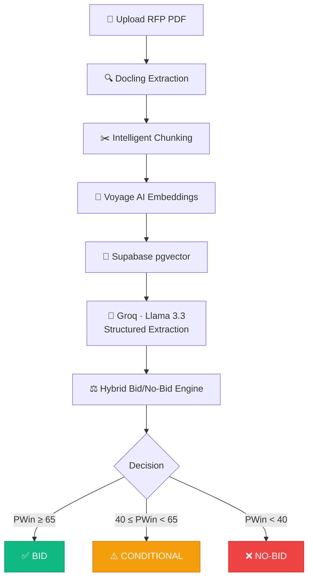

<a id="readme-top"></a>

<div align="center">

  [![Stars][stars-shield]][stars-url]
  [![Forks][forks-shield]][forks-url]
  [![Issues][issues-shield]][issues-url]
  [![LinkedIn][linkedin-shield]][linkedin-url]

  <br />

  <a href="https://github.com/rudyxx007/TenderSync">
    
  </a>

  <h1>TenderSync</h1>

  <p><strong>AI-Powered RFP Bid/No-Bid Decision Intelligence Platform</strong></p>
  <p><sub>Transform days of manual RFP analysis into a 2-minute automated decision.</sub></p>

  <br />

  <a href="#-deployment"><kbd>&nbsp;&nbsp;🌐 Live Demo&nbsp;&nbsp;</kbd></a>&ensp;
  <a href="https://github.com/rudyxx007/TenderSync/issues/new?labels=bug&title=Bug%3A+"><kbd>&nbsp;&nbsp;🐛 Report Bug&nbsp;&nbsp;</kbd></a>&ensp;
  <a href="https://github.com/rudyxx007/TenderSync/issues/new?labels=enhancement&title=Feature%3A+"><kbd>&nbsp;&nbsp;💡 Request Feature&nbsp;&nbsp;</kbd></a>

  <br /><br />

  

</div>

<br />

---

<details open>
<summary><h2>📋 Table of Contents</h2></summary>

- [About](#-about)
- [The Problem](#-the-problem)
- [How It Works](#%EF%B8%8F-how-it-works)
- [Key Features](#-key-features)
- [Screenshots](#-screenshots)
- [Built With](#%EF%B8%8F-built-with)
- [Architecture](#-architecture)
- [Project Structure](#-project-structure)
- [Getting Started](#-getting-started)
- [Deployment](#-deployment)
- [API Reference](#-api-reference)
- [Roadmap](#%EF%B8%8F-roadmap)
- [Known Limitations](#%EF%B8%8F-known-limitations)
- [License](#-license)
- [Author](#-author)
- [Acknowledgments](#-acknowledgments)

</details>

<br />

---

## 💡 About

> [!NOTE]
> 🖼️ App screenshots will be added after the frontend is deployed.

**TenderSync** is an enterprise-grade B2B SaaS platform that helps companies evaluate government and corporate RFP (Request for Proposal) tenders using AI. It combines a **Retrieval-Augmented Generation (RAG) pipeline** with an industry-aligned **Bid/No-Bid decision engine** to transform days of manual tender review into a **2-minute, AI-powered decision**, personalized to each company's unique capabilities.

> _Think of it as a **Bloomberg Terminal for Tenders**: one upload, one score, one decision._

<p align="right"><a href="#readme-top">↑ back to top</a></p>

---

## 🎯 The Problem

Every year, companies lose **thousands of hours** and **significant revenue** sifting through 200+ page RFP documents, only to discover they don't qualify or the opportunity isn't worth pursuing.

| Pain Point                                | Impact                                |
| :---------------------------------------- | :------------------------------------ |
| 📄 Reading 200+ pages per tender manually | **3–5 business days** per evaluation  |
| ❌ Missing mandatory compliance criteria  | Wasted bid preparation costs          |
| 🎲 Gut-feel based Bid/No-Bid decisions    | Low win rates, wasted resources       |
| 🔄 No institutional memory across bids    | Same mistakes repeated                |

**TenderSync eliminates all of this.** Upload a PDF → get an AI-extracted summary → receive a weighted Probability of Win (PWin) score → make an informed BID, CONDITIONAL, or NO-BID decision in minutes.

<p align="right"><a href="#readme-top">↑ back to top</a></p>

---

## ⚙️ How It Works



### The 4-Phase Evaluation Pipeline

| Phase | Description                                                                   | Method               |
| :---: | :---------------------------------------------------------------------------- | :------------------- |
| **A** | **Hard Gate Checks**: deal killers like value mismatch or missing certs        | Deterministic rules  |
| **B** | **Numeric/Keyword Scoring**: capability overlap, cert matches, budget fit      | Algorithmic scoring  |
| **C** | **LLM Subjective Scoring**: competitive landscape, strategic alignment        | Groq Llama 3.3       |
| **D** | **Weighted PWin Calculation**: 7 dimensions aggregated into a 0–100 score     | Weighted aggregation |

### The 7 Scoring Dimensions

| Dimension             | Weight | What It Measures                                           |
| :-------------------- | :----: | :--------------------------------------------------------- |
| Capability Fit        |  20%   | How well core capabilities match the RFP requirements      |
| Compliance Readiness  |  10%   | Certification and regulatory coverage                      |
| Commercial Viability  |  15%   | Budget alignment and contract value thresholds             |
| Past Performance      |  15%   | Relevant sector experience                                 |
| Competitive Landscape |  10%   | Estimated competition intensity                            |
| Strategic Alignment   |  15%   | Alignment with company's strategic focus areas             |
| Delivery Feasibility  |  15%   | Timeline, team capacity, and geographic coverage           |

<p align="right"><a href="#readme-top">↑ back to top</a></p>

---

## ✨ Key Features

<table>
  <tr>
    <td width="50%" valign="top">
      <h3>🧠 AI-Powered Extraction</h3>
      <p>Leverages <b>Groq Llama 3.3</b> and <b>Voyage AI</b> embeddings within a full RAG pipeline to extract tender IDs, issuing authorities, deadlines, budgets, deliverables, and compliance criteria from raw PDF documents.</p>
    </td>
    <td width="50%" valign="top">
      <h3>🚦 Hybrid Bid/No-Bid Engine</h3>
      <p>A 4-phase engine combining <b>deterministic hard-gate checks</b> with <b>LLM-scored subjective dimensions</b> across 7 weighted factors, producing a mathematically grounded recommendation with full factor breakdowns.</p>
    </td>
  </tr>
  <tr>
    <td width="50%" valign="top">
      <h3>🏢 Multi-Tenant Profile Gating</h3>
      <p>Each user represents one company. Mandatory onboarding enforces completion of company name, certifications, and capabilities <b>before</b> any analysis is allowed, ensuring every evaluation is personalized.</p>
    </td>
    <td width="50%" valign="top">
      <h3>📊 Decision Dashboard</h3>
      <p>A dark-themed dashboard with a circular <b>PWin gauge</b>, color-coded decision indicators (emerald / amber / red), radar charts for factor breakdown, and hard-gate status pills.</p>
    </td>
  </tr>
  <tr>
    <td width="50%" valign="top">
      <h3>🔒 Enterprise Authentication</h3>
      <p>Supabase JWT authentication with email/password sign-up, cookie-based session management via <code>@supabase/ssr</code>, and Row-Level Security (RLS) for complete data isolation between tenants.</p>
    </td>
    <td width="50%" valign="top">
      <h3>📅 Calendar Export</h3>
      <p>Automatically parses extracted submission deadlines and generates downloadable <code>.ics</code> calendar files, so you never miss a tender deadline.</p>
    </td>
  </tr>
</table>

<p align="right"><a href="#readme-top">↑ back to top</a></p>

---

## 📸 Screenshots

> [!NOTE]
> Screenshots will be added after the frontend is deployed on Vercel.

| Page              | Description                                          |
| :---------------- | :--------------------------------------------------- |
| Landing Page      | Animated hero with gradient mesh, feature bento grid |
| Login / Signup    | Glassmorphic auth cards over gradient background     |
| Onboarding Wizard | 3-step company profile setup flow                    |
| Dashboard         | PDF upload zone, PWin result cards, recent analyses  |
| Tender Detail     | Full evaluation breakdown with gauge, gates, factors |
| Tender History    | Sortable analysis history table                      |

<p align="right"><a href="#readme-top">↑ back to top</a></p>

---

## 🛠️ Built With

<div align="center">
<br />
<table>
  <tr>
    <td align="center" width="96">
      <a href="https://nextjs.org/"></a>
      <br /><sub><b>Next.js 15</b></sub>
    </td>
    <td align="center" width="96">
      <a href="https://www.typescriptlang.org/"></a>
      <br /><sub><b>TypeScript</b></sub>
    </td>
    <td align="center" width="96">
      <a href="https://tailwindcss.com/"></a>
      <br /><sub><b>Tailwind CSS</b></sub>
    </td>
    <td align="center" width="96">
      <a href="https://www.python.org/"></a>
      <br /><sub><b>Python 3.10+</b></sub>
    </td>
    <td align="center" width="96">
      <a href="https://fastapi.tiangolo.com/"></a>
      <br /><sub><b>FastAPI</b></sub>
    </td>
    <td align="center" width="96">
      <a href="https://supabase.com/"></a>
      <br /><sub><b>Supabase</b></sub>
    </td>
  </tr>
  <tr>
    <td align="center" width="96">
      <a href="https://vercel.com/"></a>
      <br /><sub><b>Vercel</b></sub>
    </td>
    <td align="center" width="96">
      <a href="https://www.postgresql.org/"></a>
      <br /><sub><b>PostgreSQL</b></sub>
    </td>
    <td align="center" width="96">
      <a href="https://ui.shadcn.com/"></a>
      <br /><sub><b>shadcn/ui</b></sub>
    </td>
    <td align="center" width="96">
      <a href="https://docs.pydantic.dev/"></a>
      <br /><sub><b>Pydantic</b></sub>
    </td>
    <td align="center" width="96">
      <a href="https://llama.meta.com/"></a>
      <br /><sub><b>Llama 3.3</b><br/>(via Groq)</sub>
    </td>
    <td align="center" width="96">
      <a href="https://github.com/docling-project/docling"></a>
      <br /><sub><b>Docling</b></sub>
    </td>
  </tr>
</table>
<br />
</div>

| Layer             | Technologies                                                                     |
| :---------------- | :------------------------------------------------------------------------------- |
| **Frontend**      | Next.js 15 (App Router) · TypeScript · Tailwind CSS · shadcn/ui                 |
| **Backend**       | FastAPI · Python 3.10+ · Pydantic · Uvicorn                                     |
| **AI / ML**       | Groq Llama 3.3 (Extraction) · Voyage AI (Embeddings) · Docling (PDF Parsing)    |
| **Database**      | Supabase PostgreSQL + pgvector + Row-Level Security                              |
| **Auth**          | Supabase Auth (JWT) · `@supabase/ssr`                                            |
| **Deployment**    | Vercel (Frontend) · Local GPU Server (Backend)                                   |

<p align="right"><a href="#readme-top">↑ back to top</a></p>

---

## 🌐 Architecture

<div align="center">
  
</div>

<br />

> [!IMPORTANT]
> The backend currently runs on a **local development machine** (see [Known Limitations](#%EF%B8%8F-known-limitations)). Once deployed to production, the frontend on Vercel will communicate with the backend via HTTPS.

<p align="right"><a href="#readme-top">↑ back to top</a></p>

---

## 📂 Project Structure

```
TenderSync/
│
├── main.py                 # FastAPI app, all routes, CORS, full RAG pipeline
├── auth.py                 # Supabase JWT verification + dev bypass mode
├── bid_engine.py           # 4-phase hybrid Bid/No-Bid engine (451 lines)
├── profile_service.py      # Company profile CRUD + completeness validation
├── schemas.py              # Pydantic request/response models
├── requirements.txt        # Python dependencies
│
├── docs/
│   └── APPLICATION_DESIGN.md    # Full architecture + design specification
│
├── assets/
│   ├── tendersync_logo.png      # Project logo
│   └── architecture_diagram.png # System architecture diagram
│
├── .env                    # Environment variables (git-ignored)
├── .gitignore
├── LICENSE
└── README.md               # ← You are here
```

> [!NOTE]
> The Next.js frontend directory will be added once the frontend is built and integrated.

<p align="right"><a href="#readme-top">↑ back to top</a></p>

---

## 🚀 Getting Started

### Prerequisites

| Requirement           | Version | Purpose                 |
| :-------------------- | :------ | :---------------------- |
| **Python**            | 3.10+   | Backend runtime         |
| **Node.js**           | 18+     | Frontend runtime        |
| **npm** or **pnpm**   | Latest  | Package management      |
| **Supabase Account**  | –       | Auth + Database         |
| **Groq API Key**      | –       | LLM inference           |
| **Voyage AI API Key** | –       | Embedding generation    |

### 1. Clone & Backend Setup

```bash
# Clone the repository
git clone https://github.com/rudyxx007/TenderSync.git
cd TenderSync

# Create and activate a virtual environment
python -m venv venv

# Windows
venv\Scripts\activate

# macOS / Linux
source venv/bin/activate

# Install dependencies
pip install -r requirements.txt
```

### 2. Configure Environment Variables

Create a `.env` file in the project root:

```env
# Supabase
SUPABASE_URL=https://your-project-ref.supabase.co
SUPABASE_SECRET_KEY=your-supabase-service-role-key

# AI Services
VOYAGE_API_KEY=your-voyage-api-key
GROQ_API_KEY=your-groq-api-key

# Development Mode (set to false in production)
ALLOW_DEV_BYPASS=true
DEVELOPMENT_USER_ID=your-test-user-uuid
```

| Variable               | Required | Description                                                   |
| :--------------------- | :------: | :------------------------------------------------------------ |
| `SUPABASE_URL`         |    ✅    | Your Supabase project URL                                     |
| `SUPABASE_SECRET_KEY`  |    ✅    | Service role key (never expose to frontend)                   |
| `VOYAGE_API_KEY`       |    ✅    | API key from [voyageai.com](https://www.voyageai.com/)        |
| `GROQ_API_KEY`         |    ✅    | API key from [groq.com](https://groq.com/)                    |
| `ALLOW_DEV_BYPASS`     |    ❌    | Enables auth bypass for local testing (default: `false`)      |
| `DEVELOPMENT_USER_ID`  |    ❌    | UUID used when bypass is enabled                              |

### 3. Run the Backend

```bash
uvicorn main:app --reload --host 127.0.0.1 --port 8000
```

The API will be live at `http://127.0.0.1:8000` with interactive Swagger docs at [`http://127.0.0.1:8000/docs`](http://127.0.0.1:8000/docs).

### 4. Frontend Setup

> [!NOTE]
> Frontend setup instructions will be added once the Next.js app is built and integrated into this repository.

<p align="right"><a href="#readme-top">↑ back to top</a></p>

---

## 🌐 Deployment

> [!IMPORTANT]
> 🚧 **The application is under active development. Deployment links will be updated here once live.**
>
> ```
> 🔗 Live App:  https://[COMING_SOON].vercel.app
> ```

| Layer          | Service                          |     Status     |
| :------------- | :------------------------------- | :------------: |
| **Frontend**   | Vercel (Next.js 15)              | 🔜 Coming Soon |
| **Backend**    | Local GPU Server (FastAPI)       | ✅ Running     |
| **Database**   | Supabase (PostgreSQL + pgvector) | ✅ Active      |
| **Auth**       | Supabase Auth (JWT + RLS)        | ✅ Active      |

<p align="right"><a href="#readme-top">↑ back to top</a></p>

---

## 📡 API Reference

All authenticated endpoints require `Authorization: Bearer <supabase_jwt>`.

<details>
<summary><kbd>&nbsp;🔐 Authentication&nbsp;</kbd></summary>
<br />

| Method | Endpoint  | Description                             |
| :----: | :-------- | :-------------------------------------- |
| `GET`  | `/api/me` | Returns authenticated user ID and email |

</details>

<details>
<summary><kbd>&nbsp;🏢 Company Profile&nbsp;</kbd></summary>
<br />

| Method | Endpoint              | Description                                               |
| :----: | :-------------------- | :-------------------------------------------------------- |
| `GET`  | `/api/profile/status` | Check profile existence, completeness, and missing fields |
| `PUT`  | `/api/profile`        | Create or update company profile                          |

</details>

<details>
<summary><kbd>&nbsp;📄 Tender Analysis&nbsp;</kbd></summary>
<br />

| Method | Endpoint             | Description                                         |
| :----: | :------------------- | :-------------------------------------------------- |
| `POST` | `/api/upload-tender` | Upload PDF → RAG extraction → Bid/No-Bid evaluation |
| `GET`  | `/api/my-analyses`   | List all past tender analyses                       |
| `GET`  | `/api/analysis/{id}` | Get full detail for a specific analysis             |

</details>

<details>
<summary><kbd>&nbsp;📅 Utilities&nbsp;</kbd></summary>
<br />

| Method | Endpoint                 | Description                                          |
| :----: | :----------------------- | :--------------------------------------------------- |
| `POST` | `/api/generate-calendar` | Generate `.ics` calendar file from a deadline string |

</details>

<p align="right"><a href="#readme-top">↑ back to top</a></p>

---

## 🗺️ Roadmap

- [X] **Phase 1: Backend API + RAG Pipeline**
  - [X] Supabase JWT authentication with dev bypass
  - [X] Company profile CRUD with completeness validation
  - [X] PDF upload → Docling extraction → Voyage AI embedding → pgvector storage
  - [X] Groq Llama 3.3 structured data extraction
  - [X] Hybrid 4-phase Bid/No-Bid evaluation engine
  - [X] Tender analysis history (save, list, detail)
  - [X] Calendar export (.ics generation)
- [ ] **Phase 2: Next.js Frontend**
  - [ ] Landing page with animated hero + feature showcase
  - [ ] Auth flow (login, signup, session management)
  - [ ] Onboarding wizard (3-step company profile setup)
  - [ ] Dashboard with PDF upload + result display
  - [ ] Tender detail page with PWin gauge + factor breakdown
  - [ ] History page with sortable analysis table
  - [ ] Settings / profile edit page
  - [ ] Dark mode, responsive layout, micro-animations
- [ ] **Phase 3: Deployment + Polish**
  - [ ] Vercel deployment (frontend)
  - [ ] Production environment hardening
  - [ ] Performance optimization + Lighthouse audit
- [ ] **Phase 4: Future Enhancements**
  - [ ] Cloud GPU migration for faster processing
  - [ ] Multi-user per organization (team features)
  - [ ] Tender comparison (side-by-side analysis)
  - [ ] Email notifications for upcoming deadlines
  - [ ] Batch PDF upload support
  - [ ] Export evaluation reports as PDF

<p align="right"><a href="#readme-top">↑ back to top</a></p>

---

## ⚠️ Known Limitations

> Transparency is important. Here are the current constraints and how I plan to address them.

### Development Hardware

| Component | Specification             |
| :-------- | :------------------------ |
| **GPU**   | NVIDIA RTX 5050 (Laptop)  |
| **RAM**   | 24 GB DDR5                |
| **CPU**   | Intel Core Ultra 7        |

### Current Constraints

| Limitation             | Detail                                                                                                     | Planned Resolution                                         |
| :--------------------- | :--------------------------------------------------------------------------------------------------------- | :--------------------------------------------------------- |
| **Processing Speed**   | A single ~100-page RFP takes **30–90 seconds** to fully process through the extraction + evaluation pipeline | Cloud GPU migration (RunPod / Lambda Labs) to bring this down to ~5–10 seconds |
| **Concurrency**        | Single-user experience; simultaneous uploads are processed sequentially                                    | Horizontal scaling on cloud infrastructure                 |
| **Availability**       | Backend is only available while the dev machine is running                                                  | 24/7 cloud deployment                                     |
| **VRAM Pressure**      | Docling's internal models require ~2–4 GB VRAM, leaving limited headroom for parallel tasks                 | Dedicated GPU server with ≥24 GB VRAM                      |

> [!TIP]
> Despite these hardware constraints, the **core architecture is production-ready**. The RAG pipeline, Bid/No-Bid engine, auth flow, and multi-tenant data isolation are all built to scale. The only bottleneck is compute, which is a deployment concern, not an architecture concern.

<p align="right"><a href="#readme-top">↑ back to top</a></p>

---

## 📄 License

**© 2026 Rudra Bhavin Naik. All Rights Reserved.**

This project is shared publicly for **portfolio and educational purposes only**.

| ✅ Permitted                                                                          | ❌ Not Permitted                                                                      |
| :------------------------------------------------------------------------------------ | :------------------------------------------------------------------------------------ |
| View source code for personal learning                                                | Copy, redistribute, or republish this codebase as your own                            |
| Reference the project in articles or academic work (with attribution)                 | Use this code in commercial products or services                                      |
| Fork the repository for personal, non-commercial experimentation                      | Create derivative works for public distribution without written permission            |

See the full [`LICENSE`](LICENSE) file for details. For inquiries, [contact the author](#-author).

<p align="right"><a href="#readme-top">↑ back to top</a></p>

---

## 👤 Author

<div align="center">
<br />

| | |
| :-: | :--- |
| 👤 | **Rudra Bhavin Naik** |
| 🐙 | [@rudyxx007](https://github.com/rudyxx007) |
| 💼 | [LinkedIn](https://linkedin.com/in/rudy7404) |
| 📧 | [rudyop007@gmail.com](mailto:rudyop007@gmail.com) |

<br />

**Project:** [github.com/rudyxx007/TenderSync](https://github.com/rudyxx007/TenderSync)

</div>

<p align="right"><a href="#readme-top">↑ back to top</a></p>

---

## 🙏 Acknowledgments

| | Tool | Role in TenderSync |
| :---: | :--- | :--- |
|  | [FastAPI](https://fastapi.tiangolo.com/) | Backend web framework |
|  | [Supabase](https://supabase.com/) | Auth, database, vector storage |
|  | [Next.js](https://nextjs.org/) | Frontend framework |
|  | [Tailwind CSS](https://tailwindcss.com/) | Utility-first styling |
|  | [shadcn/ui](https://ui.shadcn.com/) | Component library |
| 📄 | [Docling](https://github.com/docling-project/docling) | PDF extraction engine |
| 🤖 | [Groq](https://groq.com/) | LLM inference |
| 🧠 | [Voyage AI](https://www.voyageai.com/) | Embedding generation |
| 🛡️ | [Shields.io](https://shields.io/) | README badges |
| 🎨 | [Skill Icons](https://skillicons.dev/) | Tech stack visuals |

<p align="right"><a href="#readme-top">↑ back to top</a></p>

---

<div align="center">
  <sub>Built with ❤️ and way too much ☕ for smarter RFP decisions.</sub>
  <br /><br />
  <b>If this project interests you, consider leaving a ⭐</b>
</div>

<!-- REFERENCE LINKS -->

[stars-shield]: https://img.shields.io/github/stars/rudyxx007/TenderSync?style=for-the-badge&logo=starship&logoColor=white&labelColor=0D1117&color=10B981
[stars-url]: https://github.com/rudyxx007/TenderSync/stargazers
[forks-shield]: https://img.shields.io/github/forks/rudyxx007/TenderSync?style=for-the-badge&logo=git&logoColor=white&labelColor=0D1117&color=3B82F6
[forks-url]: https://github.com/rudyxx007/TenderSync/network/members
[issues-shield]: https://img.shields.io/github/issues/rudyxx007/TenderSync?style=for-the-badge&logo=github&logoColor=white&labelColor=0D1117&color=F59E0B
[issues-url]: https://github.com/rudyxx007/TenderSync/issues
[linkedin-shield]: https://img.shields.io/badge/LinkedIn-Connect-0A66C2?style=for-the-badge&logo=linkedin&logoColor=white&labelColor=0D1117
[linkedin-url]: https://linkedin.com/in/rudy7404
