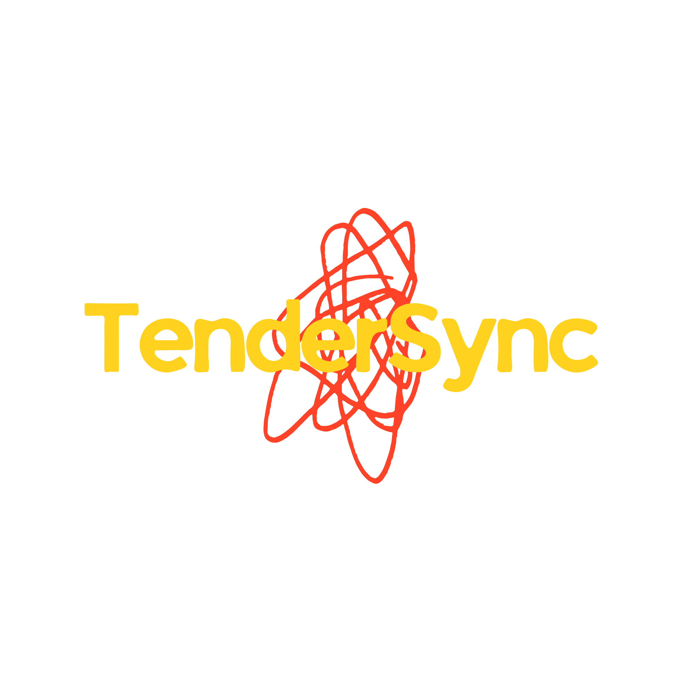
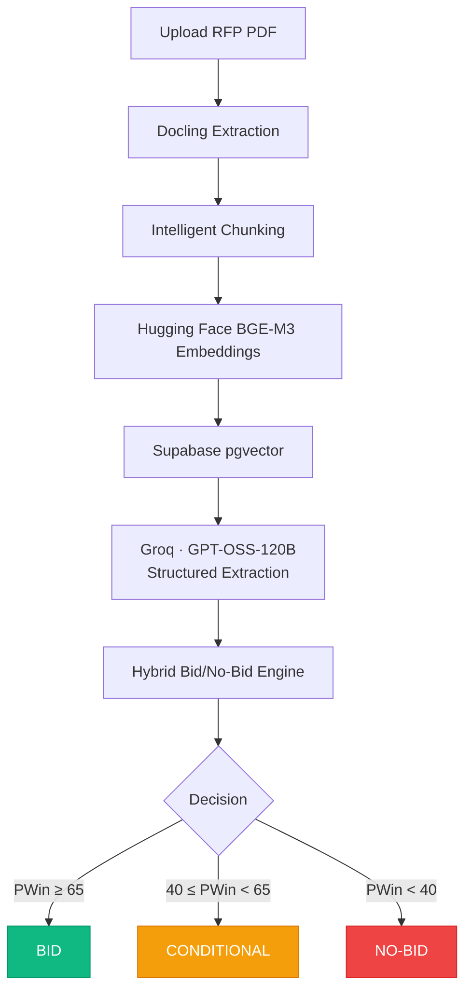
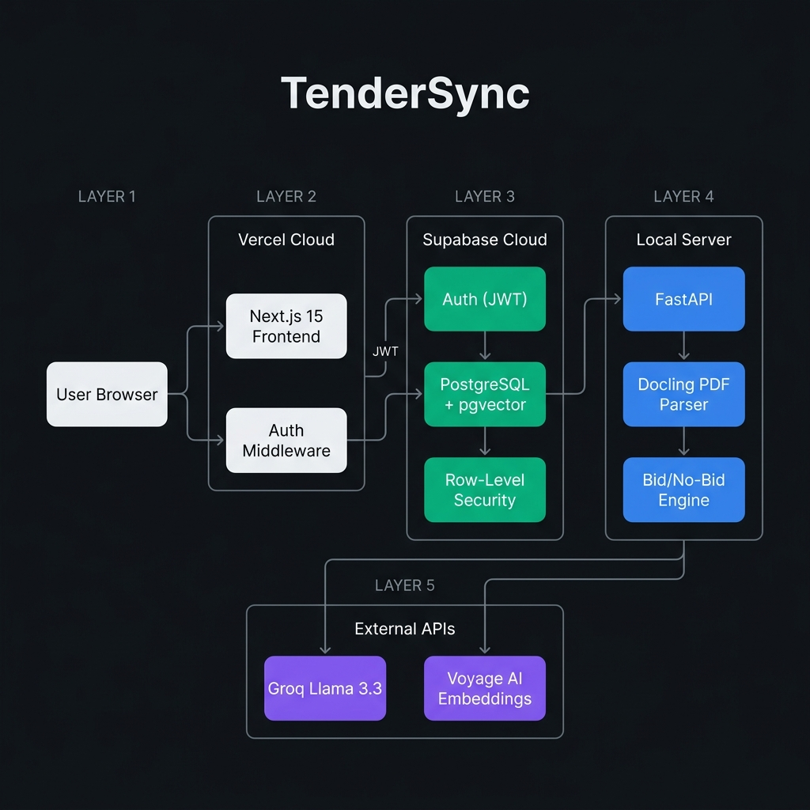

<div align="center">

  [![Stars][stars-shield]][stars-url]
  [![Forks][forks-shield]][forks-url]
  [![Issues][issues-shield]][issues-url]
  [![LinkedIn][linkedin-shield]][linkedin-url]

  <br />

  <a href="https://github.com/rudyxx007/TenderSync">
    
  </a>
  <h3><strong>Autonomous Tender Intelligence & AI Proposal Engine</strong></h3>
  <h3><sub>The engine behind your next government contract.</sub></h3>

  <br />

  <a href="#deployment"><kbd>&nbsp;&nbsp;Live Demo&nbsp;&nbsp;</kbd></a>&ensp;
  <a href="https://github.com/rudyxx007/TenderSync/issues/new?labels=bug&title=Bug%3A+"><kbd>&nbsp;&nbsp;Report Bug&nbsp;&nbsp;</kbd></a>&ensp;
  <a href="https://github.com/rudyxx007/TenderSync/issues/new?labels=enhancement&title=Feature%3A+"><kbd>&nbsp;&nbsp;Request Feature&nbsp;&nbsp;</kbd></a>

  <br /><br />

  

</div>

<br />

---

<details open>
<summary><h2>Table of Contents</h2></summary>

- [About](#about)
- [The Problem](#the-problem)
- [How It Works](#how-it-works)
- [Key Features](#key-features)
- [Screenshots](#screenshots)
- [Built With](#built-with)
- [Architecture](#architecture)
- [Project Structure](#project-structure)
- [Getting Started](#getting-started)
- [Deployment](#deployment)
- [API Reference](#api-reference)
- [Roadmap](#roadmap)
- [Known Limitations](#known-limitations)
- [License](#license)
- [Author](#author)
- [Acknowledgments](#acknowledgments)

</details>

<br />

---

## About

> [!NOTE]
> App screenshots will be added after the frontend is deployed.

**TenderSync** is an enterprise-grade B2B SaaS platform that helps companies evaluate government and corporate RFP (Request for Proposal) tenders using AI. It combines a **Retrieval-Augmented Generation (RAG) pipeline** with an industry-aligned **Bid/No-Bid decision engine** to transform days of manual tender review into a **2-minute, AI-powered decision**, personalized to each company's unique capabilities.

> _Think of it as a **Bloomberg Terminal for Tenders**: one upload, one score, one decision._

<p align="right"><a href="#readme-top">↑ back to top</a></p>

---

## The Problem

Government and enterprise bidding is notoriously high-friction, error-prone, and slow. B2B companies lose **thousands of hours and millions in revenue** chasing tenders they don't qualify for, missing critical deadlines, and drafting 50-page proposals from scratch under pressure.

| Lifecycle Stage | Traditional Pain Point | Business Impact |
| :--- | :--- | :--- |
| **Discovery** | Manually searching fragmented public portals (CPPP, GeM) | Missed deadlines & high opportunity scouting overhead |
| **Document Ingestion** | Reading 200+ page legalistic RFP PDFs manually | **3–5 business days** spent per evaluation |
| **Compliance Gating** | Overlooking hidden mandatory certs or eligibility criteria | Instant disqualification & wasted bid prep costs |
| **Bid Qualification** | Bidding based on executive gut feeling rather than data | Low win rates & exhausted capture budgets |
| **Trade-off Analysis** | Inability to objectively compare concurrent tender opportunities | Misallocated team resources on low-yield bids |
| **Proposal Drafting** | Writing technical responses & compliance matrices from scratch | Grueling 40-hour writing cycles & rushed submissions |
| **Team Collaboration** | Disconnected bids with no shared institutional memory | Siloed teams & repeated historical mistakes |

<br />

**TenderSync eliminates every bottleneck across the RFP lifecycle.**  
**Auto-discover** live market tenders ➔ **Extract** 200+ page PDFs in seconds ➔ **Screen** hard-gate deal-breakers ➔ **Score** win probability across 7 dimensions ➔ **Draft** tailored proposals with multi-agent AI.

<p align="right"><a href="#readme-top">↑ back to top</a></p>

---

## How It Works



### The 4-Phase Evaluation Pipeline

|    Phase    | Description                                                                      | Method               |
| :---------: | :------------------------------------------------------------------------------- | :------------------- |
| **A** | **Hard Gate Checks**: deal killers like value mismatch or missing certs    | Deterministic rules  |
| **B** | **Numeric/Keyword Scoring**: capability overlap, cert matches, budget fit  | Algorithmic scoring  |
| **C** | **LLM Subjective Scoring**: competitive landscape, strategic alignment     | Groq GPT-OSS-120B    |
| **D** | **Weighted PWin Calculation**: 7 dimensions aggregated into a 0–100 score | Weighted aggregation |

### The 7 Scoring Dimensions

| Dimension             | Weight | What It Measures                                      |
| :-------------------- | :----: | :---------------------------------------------------- |
| Capability Fit        |  20%  | How well core capabilities match the RFP requirements |
| Compliance Readiness  |  15%  | Certification and regulatory coverage                 |
| Commercial Viability  |  15%  | Budget alignment and contract value thresholds        |
| Past Performance      |  15%  | Relevant sector experience                            |
| Delivery Feasibility  |  15%  | Timeline, team capacity, and geographic coverage      |
| Competitive Landscape |  10%  | Estimated competition intensity                       |
| Strategic Alignment   |  10%  | Alignment with company's strategic focus areas        |

<p align="right"><a href="#readme-top">↑ back to top</a></p>

---

## Key Features

<table>
  <tr>
    <td width="50%" valign="top">
      <h3>AI-Powered Extraction</h3>
      <p>Leverages <b>Groq GPT-OSS-120B</b> and <b>Hugging Face BGE-M3</b> embeddings within a full RAG pipeline to extract tender IDs, issuing authorities, deadlines, budgets, deliverables, and compliance criteria from raw PDF documents.</p>
      <p></p>
    </td>
    <td width="50%" valign="top">
      <h3>Hybrid Bid/No-Bid Engine</h3>
      <p>A 4-phase engine combining <b>deterministic hard-gate checks</b> with <b>LLM-scored subjective dimensions</b> across 7 weighted factors, producing a mathematically grounded recommendation with full factor breakdowns.</p>
      <p></p>
    </td>
  </tr>
  <tr>
    <td width="50%" valign="top">
      <h3>Multi-Tenant Profile Gating</h3>
      <p>Each user represents one company. Mandatory onboarding enforces completion of company name, certifications, and capabilities <b>before</b> any analysis is allowed, ensuring every evaluation is personalized.</p>
      <p></p>
    </td>
    <td width="50%" valign="top">
      <h3>Decision Dashboard</h3>
      <p>A dark-themed dashboard with a circular <b>PWin gauge</b>, color-coded decision indicators (emerald / amber / red), radar charts for factor breakdown, and hard-gate status pills.</p>
      <p></p>
    </td>
  </tr>
  <tr>
    <td width="50%" valign="top">
      <h3>Market Tenders Discovery</h3>
      <p>Automated scraping of public portals (e.g., CPPP) to bring relevant market tenders directly into your dashboard. Evaluate public tenders with one click.</p>
      <p></p>
    </td>
    <td width="50%" valign="top">
      <h3>Side-by-Side Comparison</h3>
      <p>Compare two analyzed tenders side-by-side using Groq LLM to evaluate budget, deadlines, compliance, and deliverable differences.</p>
      <p></p>
    </td>
  </tr>
  <tr>
    <td width="50%" valign="top">
      <h3>AI Proposal Writer (LangGraph)</h3>
      <p>A multi-agent orchestrator (Analyst, Researcher, Writer, Reviewer) that automatically generates a complete proposal draft based on the tender analysis and your company capabilities.</p>
      <p></p>
    </td>
    <td width="50%" valign="top">
      <h3>Calendar Export & PDF Reports</h3>
      <p>Generate downloadable <code>.ics</code> calendar files for deadlines, and export beautiful PDF reports of your tender evaluations using WeasyPrint and Plotly.</p>
      <p></p>
    </td>
  </tr>
</table>

<p align="right"><a href="#readme-top">↑ back to top</a></p>

---

## Screenshots

> [!NOTE]
> Screenshots will be added after the frontend is deployed on Vercel.

| Page              | Description                                          |
| :---------------- | :--------------------------------------------------- |
| **Landing Page** (`/`) | Value proposition hero with live interactive sample evaluation and feature bento grid |
| **How It Works** (`/how-it-works`) | Deep-dive breakdown of the 5-stage ingestion pipeline, 7-dimension scoring engine, and proposal agents |
| **About** (`/about`) | The TenderSync mission, the cost of bad bids, and core principles (evidence-first, human-in-the-loop) |
| **Login / Signup** (`/login`, `/signup`) | Authentication surfaces with live decision preview and multi-tenant invite code handling |
| **Onboarding Wizard** (`/onboarding`) | Step-by-step company capability and compliance profile builder |
| **Command Center** (`/dashboard`) | Drag-and-drop RFP upload zone, live 5-stage pipeline trace, and recent dossiers |
| **Executive Dossier** (`/tenders/:id`) | Comprehensive evaluation breakdown with PWin score gauge, hard gates, 7-factor radar fit chart, and PDF export |
| **Proposal Editor** (`/proposals/:id`) | Multi-agent generated response sections with inline editing and Microsoft Word (`.docx`) export |
| **Comparison Matrix** (`/tenders/compare`) | Multi-tender side-by-side radar overlay and AI comparative trade-off analysis |
| **Market Discovery** (`/discovery`) | Live scraped public tenders from government portals with 1-click evaluation |

<p align="right"><a href="#readme-top">↑ back to top</a></p>

---

## Built With

<div align="center">
<br />
<table>
  <tr>
    <td align="center" width="110">
      <a href="https://nextjs.org/"></a>
      <br /><sub><b>Next.js 15</b></sub>
    </td>
    <td align="center" width="110">
      <a href="https://www.typescriptlang.org/"></a>
      <br /><sub><b>TypeScript</b></sub>
    </td>
    <td align="center" width="110">
      <a href="https://tailwindcss.com/"></a>
      <br /><sub><b>Tailwind CSS</b></sub>
    </td>
    <td align="center" width="110">
      <a href="https://www.python.org/"></a>
      <br /><sub><b>Python 3.10+</b></sub>
    </td>
    <td align="center" width="110">
      <a href="https://fastapi.tiangolo.com/"></a>
      <br /><sub><b>FastAPI</b></sub>
    </td>
    <td align="center" width="110">
      <a href="https://supabase.com/"></a>
      <br /><sub><b>Supabase</b></sub>
    </td>
  </tr>
  <tr>
    <td align="center" width="110">
      <a href="https://openai.com/"></a>
      <br /><sub><b>GPT-OSS-120B</b><br/>(OpenAI)</sub>
    </td>
    <td align="center" width="110">
      <a href="https://huggingface.co/BAAI/bge-m3"></a>
      <br /><sub><b>BAAI/bge-m3</b><br/>(Hugging Face)</sub>
    </td>
    <td align="center" width="110">
      <a href="https://www.langchain.com/langgraph"></a>
      <br /><sub><b>LangGraph</b><br/>(Multi-Agent)</sub>
    </td>
    <td align="center" width="110">
      <a href="https://www.postgresql.org/"></a>
      <br /><sub><b>PostgreSQL</b><br/>(pgvector)</sub>
    </td>
    <td align="center" width="110">
      <a href="https://vercel.com/"></a>
      <br /><sub><b>Vercel</b></sub>
    </td>
    <td align="center" width="110">
      <a href="https://ui.shadcn.com/"></a>
      <br /><sub><b>shadcn/ui</b></sub>
    </td>
  </tr>
  <tr>
    <td align="center" width="110">
      <a href="https://github.com/docling-project/docling"></a>
      <br /><sub><b>IBM Docling</b><br/>(Deep Search)</sub>
    </td>
    <td align="center" width="110">
      <a href="https://plotly.com/"></a>
      <br /><sub><b>Plotly</b><br/>(Radar Charts)</sub>
    </td>
    <td align="center" width="110">
      <a href="https://www.selenium.dev/"></a>
      <br /><sub><b>Selenium</b><br/>(Web Scraping)</sub>
    </td>
    <td align="center" width="110">
      <a href="https://docs.pydantic.dev/"></a>
      <br /><sub><b>Pydantic v2</b></sub>
    </td>
    <td align="center" width="110">
      <a href="https://weasyprint.org/"></a>
      <br /><sub><b>WeasyPrint</b><br/>(PDF Reports)</sub>
    </td>
    <td align="center" width="110">
      <a href="https://docs.pytest.org/"></a>
      <br /><sub><b>Pytest</b><br/>(Automated QA)</sub>
    </td>
  </tr>
</table>
<br />
</div>

| Layer | Technologies & Ecosystem |
| :--- | :--- |
| **Frontend** | **React 19** · **Vite 7** · **TanStack Router** · **Tailwind CSS v4** · **Framer Motion** · **Aceternity UI** · **Magic UI** · **Recharts** · **Lucide Icons** |
| **Backend API** | **FastAPI** · **Python 3.10+** · **Pydantic v2** · **Uvicorn** (ASGI) · Domain-Driven Routers |
| **AI Models & Agents** | **OpenAI GPT-OSS-120B** (via Groq Inference) · **LangGraph** (Multi-Agent State Machine: Executive, Technical, Compliance, Pricing, Timeline) |
| **RAG & Embeddings** | **Hugging Face BAAI/bge-m3** (1024-dim dense vectors) · **LangChain** (Recursive Semantic Text Splitters) |
| **Document Ingestion** | **Docling** (IBM Deep Search Parser) · **RapidOCR** (ONNX Scan OCR Engine) · **PyPDFium2** |
| **Database & Vector Store** | **Supabase** · **PostgreSQL** · **pgvector** (IVFFlat Indexing + Cosine Similarity RPC) · Multi-Tenant RLS |
| **Tender Discovery** | **Selenium** (Headless Browser Automation) · **BeautifulSoup4** · **HTTPX** (CPPP Portal Scraper) |
| **Export & Reporting** | **WeasyPrint** (HTML/CSS to PDF Engine) · **Recharts / Plotly** (Polar Radar Visualizations) · **Jinja2** · **python-docx** |
| **Auth & Security** | **Supabase Auth** (JWT Tokens) · **Role-Based Access Control (RBAC)** (`owner`/`admin`/`member`) · Multi-Tenant 8-char Invites |
| **Networking & Tunneling** | **Localtunnel** (`tendersync-ind-rudyxx007.loca.lt`) · **Vercel** (Global Edge Frontend) |
| **Testing & CI** | **Pytest** (68 Unit & Integration Tests — 100% Pass Rate) |

<p align="right"><a href="#readme-top">↑ back to top</a></p>

---

## Architecture

<div align="center">
  
</div>

<br />

> [!IMPORTANT]
> The backend currently runs on a **local development machine** (see [Known Limitations](#known-limitations)). Once deployed to production, the frontend on Vercel will communicate with the backend via HTTPS.

<p align="right"><a href="#readme-top">↑ back to top</a></p>

---

## Project Structure

```
TenderSync/
│
├── frontend/                   # React 19 + Vite 7 + TanStack Router web application
│   ├── client/
│   │   ├── index.html          # HTML entry point with DM Mono & Manrope typography
│   │   ├── public/             # Static assets (tendersync_logo.png, favicon.png)
│   │   └── src/
│   │       ├── components/     # AppShell, Brand, PwinGauge, Workspace, and UI components
│   │       └── ui/             # Reusable interactive UI components (spotlights, animated borders, buttons)
│   │       ├── contexts/       # ThemeContext (Dark/Light mode support)
│   │       ├── lib/            # apiFetch, apiUpload, apiDownload, Supabase client
│   │       ├── pages/          # 17 routed views (Landing, HowItWorks, About, Dashboard, Tenders, TenderDetail, Proposals, etc.)
│   │       ├── router.tsx      # TanStack Router type-safe route tree with auth gating
│   │       └── index.css       # Tailwind CSS v4 design system with custom utility layers
│   ├── vercel.json             # Vercel SPA routing rewrite configuration
│   ├── vite.config.ts          # Vite build configuration with path aliases (@ -> client/src)
│   └── package.json            # Frontend scripts and dependencies
│
├── backend/
│   ├── main.py                 # FastAPI app entry point and router aggregator
│   ├── db.py                   # Centralized Supabase/Groq clients and user dependency injection
│   ├── document_extractor.py   # Unified document extraction logic (RapidOCR, PyPDFium2, Docling)
│   ├── embedding_service.py    # Hugging Face BAAI/bge-m3 1024-dim dense embedding service
│   ├── pipeline_service.py     # RAG pipeline orchestrator (chunking, embedding, semantic retrieval)
│   ├── bid_engine.py           # 4-phase hybrid Bid/No-Bid evaluation engine (7 scoring dimensions)
│   ├── proposal_engine.py      # LangGraph multi-agent proposal generator (5 specialized agents)
│   ├── comparison_engine.py    # Multi-tender side-by-side comparative analysis (Groq LLM)
│   ├── tender_discovery.py     # Public tender scrapers (CPPP, GeM) & discovery engine
│   ├── report_generator.py     # WeasyPrint PDF evaluation report generator with Plotly charts
│   ├── profile_service.py      # Multi-tenant company profile CRUD & completeness validation
│   ├── schemas.py              # Pydantic v2 models for requests, responses, and validation
│   ├── auth.py                 # Supabase JWT authentication, user/org resolution, RBAC
│   ├── requirements.txt        # Production Python dependencies
│   ├── routers/                # Domain-driven FastAPI routers (auth, orgs, profiles, tenders, proposals, market, batches, exports)
│   ├── templates/              # Jinja2 HTML templates for downloadable PDF reports
│   ├── supabase/               # PostgreSQL + pgvector schema & versioned migrations (001 to 006)
│   └── tests/                  # 68 automated unit tests (100% pass rate)
│
├── docs/                       # Architecture & design specifications
├── assets/                     # Project logo and system architecture diagrams
├── .gitignore
├── LICENSE
└── README.md                   # ← You are here
```

<p align="right"><a href="#readme-top">↑ back to top</a></p>

---

## Getting Started

### Prerequisites

| Requirement                     | Version | Purpose                     |
| :------------------------------ | :------ | :-------------------------- |
| **Python**                | 3.10+   | Backend runtime             |
| **Node.js**               | 18+     | Frontend runtime            |
| **npm** or **pnpm**       | Latest  | Package management          |
| **Supabase Account**      | –      | Auth, PostgreSQL, pgvector  |
| **Groq API Key**          | –      | Fast LLM inference          |
| **Hugging Face Token**    | –      | BGE-M3 Embedding generation |

### 1. Clone & Backend Setup

```bash
# Clone the repository
git clone https://github.com/rudyxx007/TenderSync.git
cd TenderSync/backend

# Create and activate a virtual environment
python -m venv venv

# Windows
venv\Scripts\activate

# macOS / Linux
source venv/bin/activate

# Install dependencies
pip install -r requirements.txt
```

### 2. Configure Environment Variables

Create a `.env` file in the `backend/` directory:

```env
# Supabase
SUPABASE_URL=https://your-project-ref.supabase.co
SUPABASE_SECRET_KEY=your-supabase-service-role-key

# AI Services
HF_TOKEN=your-huggingface-read-token
GROQ_API_KEY=your-groq-api-key
GROQ_MODEL=openai/gpt-oss-120b

# Development Mode (set to false in production)
ALLOW_DEV_BYPASS=true
DEVELOPMENT_USER_ID=your-test-user-uuid
```

| Variable                | Required | Description                                               |
| :---------------------- | :------: | :-------------------------------------------------------- |
| `SUPABASE_URL`        |    Yes   | Your Supabase project URL                                 |
| `SUPABASE_SECRET_KEY` |    Yes   | Service role key (never expose to frontend)               |
| `HF_TOKEN`            |    Yes   | Hugging Face API token for BGE-M3 embeddings              |
| `GROQ_API_KEY`        |    Yes   | API key from [groq.com](https://groq.com/)                |
| `GROQ_MODEL`          |    No    | LLM model identifier (default: `openai/gpt-oss-120b`)     |
| `ALLOW_DEV_BYPASS`    |    No    | Enables auth bypass for local testing (default: `false`)   |
| `DEVELOPMENT_USER_ID` |    No    | UUID used when bypass is enabled                          |

### 3. Run the Backend & Tunnel
```bash
# Terminal 1: Start FastAPI backend
cd backend
fastapi run main.py --port 8000

# Terminal 2: Expose via Localtunnel (Fixed Subdomain)
npx localtunnel --port 8000 --subdomain tendersync-ind-rudyxx007
```

The API will be live locally at `http://127.0.0.1:8000` (docs at [`http://127.0.0.1:8000/docs`](http://127.0.0.1:8000/docs)) and publicly accessible at `https://tendersync-ind-rudyxx007.loca.lt`.

### 4. Run the Frontend (Locally)
```bash
cd frontend
npm install
npm run dev
```

The frontend will run at `http://localhost:5173`.

### 5. Run Unit Tests
```bash
cd backend
python -m pytest tests/
```

<p align="right"><a href="#readme-top">↑ back to top</a></p>

---

## Deployment

| Layer | Platform | Status | URL |
| :--- | :--- | :---: | :--- |
| **Frontend** | **Vercel** (React 19 + Vite 7 SPA) | Live | `https://tendersync-ind.vercel.app` |
| **Backend** | **Local GPU Engine + Localtunnel** | Live | `https://tendersync-ind-rudyxx007.loca.lt` |
| **Database** | **Supabase** (PostgreSQL + pgvector) | Active | `https://kprisunrhxuwmczdvixk.supabase.co` |
| **Auth** | **Supabase Auth** (JWT + RLS) | Active | Built-in |

<p align="right"><a href="#readme-top">↑ back to top</a></p>

---

## API Reference

All authenticated endpoints require `Authorization: Bearer <supabase_jwt>`.

<details>
<summary><kbd>Authentication & User</kbd></summary>
<br />

| Method | Endpoint | Description |
| :----: | :------- | :---------- |
| `GET` | `/api/me` | Returns current user ID and email |
| `GET` | `/api/auth/me` | Returns authenticated user details |

</details>

<details>
<summary><kbd>Organization & Multi-Tenancy</kbd></summary>
<br />

| Method | Endpoint | Description |
| :----: | :------- | :---------- |
| `POST` | `/api/orgs` | Create a new organization (sets user as owner) |
| `POST` | `/api/orgs/join` | Join an organization using a 6-character invite code |
| `GET` | `/api/orgs/members` | List members and roles for the current organization |
| `POST` | `/api/orgs/invite/regenerate` | Regenerate a new invite code (owner/admin only) |

</details>

<details>
<summary><kbd>Company Profile</kbd></summary>
<br />

| Method | Endpoint | Description |
| :----: | :------- | :---------- |
| `GET` | `/api/profile/status` | Check profile existence, completeness percentage, and missing fields |
| `PUT` | `/api/profile` | Create or update organization profile (capabilities, certs, budget thresholds) |

</details>

<details>
<summary><kbd>Tender Ingestion & Analysis</kbd></summary>
<br />

| Method | Endpoint | Description |
| :----: | :------- | :---------- |
| `POST` | `/api/process-tender` | Upload PDF/Scan → Docling/RapidOCR text extraction → BGE-M3 embedding → pgvector → Groq LLM extraction → 4-Phase Bid/No-Bid Evaluation |
| `POST` | `/api/upload-tender` | Alias for single tender processing |
| `POST` | `/api/tenders/process` | Standard REST route for tender processing |
| `POST` | `/api/tenders/batch` | Upload multiple tender files for asynchronous batch evaluation |
| `GET` | `/api/my-analyses` | List all historical tender analyses for the organization |
| `GET` | `/api/tenders` | REST alias for listing historical analyses |
| `GET` | `/api/analysis/{id}` | Get complete evaluation breakdown, factor scores, and extracted RFP metadata |
| `GET` | `/api/tenders/{id}` | REST alias for retrieving a specific tender analysis |
| `POST` | `/api/tenders/compare` | Compare 2+ analyzed tenders side-by-side with LLM comparative summary |

</details>

<details>
<summary><kbd>AI Proposal Generation (LangGraph)</kbd></summary>
<br />

| Method | Endpoint | Description |
| :----: | :------- | :---------- |
| `POST` | `/api/tenders/{id}/proposal` | Run LangGraph state machine (Planner → Drafter → Reviewer) to generate a tailored proposal |
| `GET` | `/api/proposals/{id}` | Retrieve generated proposal draft by ID |
| `GET` | `/api/proposals` | List all generated proposal drafts for the organization |

</details>

<details>
<summary><kbd>Market Tender Discovery</kbd></summary>
<br />

| Method | Endpoint | Description |
| :----: | :------- | :---------- |
| `GET` | `/api/market-tenders` | Query discovered public tenders with sector and deadline filters |
| `POST` | `/api/market-tenders/discover` | Trigger live scraping job across public procurement portals (CPPP, GeM) |

</details>

<details>
<summary><kbd>Batch Jobs</kbd></summary>
<br />

| Method | Endpoint | Description |
| :----: | :------- | :---------- |
| `GET` | `/api/batches` | List all background batch processing jobs for the organization |
| `GET` | `/api/batches/{id}` | Get status, progress, and individual results for a batch job |

</details>

<details>
<summary><kbd>Utilities & PDF Export</kbd></summary>
<br />

| Method | Endpoint | Description |
| :----: | :------- | :---------- |
| `POST` | `/api/generate-calendar` | Generate and download an `.ics` iCalendar file for tender submission deadlines |
| `GET` | `/api/tenders/{id}/export-pdf` | Generate and download a styled evaluation report PDF via WeasyPrint & Jinja2 |

</details>

<p align="right"><a href="#readme-top">↑ back to top</a></p>

---

## Roadmap

- [X] **Phase 1: Backend API + RAG Pipeline**
  - [X] Supabase JWT authentication with dev bypass
  - [X] Company profile CRUD with completeness validation
  - [X] PDF upload → Docling extraction → Hugging Face BGE-M3 embedding → pgvector storage
  - [X] Groq GPT-OSS-120B structured data extraction
  - [X] Hybrid 4-phase Bid/No-Bid evaluation engine
  - [X] Tender analysis history (save, list, detail)
  - [X] Calendar export (.ics generation)
- [ ] **Phase 2: Next.js Frontend**
  - [ ] Landing page with animated hero + feature showcase
  - [ ] Auth flow (login, signup, session management)
  - [ ] Onboarding wizard (3-step company profile setup)
  - [ ] Dashboard with PDF upload + result display
  - [ ] Tender detail page with PWin gauge + factor breakdown
  - [ ] History page with sortable analysis table
  - [ ] Settings / profile edit page
  - [ ] Dark mode, responsive layout, micro-animations
- [ ] **Phase 3: Deployment + Polish**
  - [ ] Vercel deployment (frontend)
  - [ ] Production environment hardening
  - [ ] Performance optimization + Lighthouse audit
- [ ] **Phase 4: Future Enhancements & Recommended Additions**
  - [X] Multi-user per organization (team features / invite codes)
  - [X] Tender comparison (side-by-side analysis + LLM summary)
  - [X] Export evaluation reports as PDF (WeasyPrint + Jinja2)
  - [X] AI Proposal Writing Engine (LangGraph state machine)
  - [X] Market Tender Discovery (Live scraping of GeM/CPPP)
  - [X] Batch PDF upload support
  - [ ] Cloud GPU migration (RunPod / Lambda Labs for ultra-fast OCR/Docling)

#### Recommended Additions (Categorized Breakdown)

<details open>
<summary><kbd>High Value (Product & Enterprise Impact)</kbd></summary>
<br />

| Feature | Description / Benefit | Status |
| :------ | :-------------------- | :----: |
| **Multi-Agent Validation** | Critic agent cross-verifying extracted JSON against raw tender text to eliminate hallucinations | Planned |
| **Compliance Matrix Export** | One-click CSV/PDF mapping RFP requirements directly to company qualification evidence | Planned |
| **Team / Org Accounts** | Multi-user collaboration under one organization with RBAC and shared tender workspaces | Complete |
| **Win/Loss Feedback Loop** | Outcome tracking to dynamically calibrate PWin weights and scoring heuristics over time | Planned |
| **Email Deadline Reminders** | Automated cron/scheduler notifications for approaching RFP submission deadlines | Planned |
| **Audit Log System** | Enterprise-grade activity timeline tracking who uploaded, analyzed, or edited dossiers | Planned |

</details>

<details>
<summary><kbd>Medium Value (UX & Workflow Efficiency)</kbd></summary>
<br />

| Feature | Description / Benefit | Status |
| :------ | :-------------------- | :----: |
| **PDF Highlight Citations** | Visual grounding showing the exact bounding boxes and chunk sources for extracted data | Planned |
| **Side-by-Side Comparison** | Multi-tender differential analysis with comparative LLM risk/feasibility breakdown | Complete |
| **Saved Filters & Views** | Quick-filter presets (e.g., *"Only show BID decisions with PWin > 80%"*) | Planned |
| **Webhooks & CRM Integration** | Bid sync and pipeline integration with Salesforce, HubSpot, and Slack | Planned |

</details>

<details>
<summary><kbd>Infrastructure & Scalability</kbd></summary>
<br />

| Feature | Description / Benefit | Status |
| :------ | :-------------------- | :----: |
| **Cloudflare Tunnel** | Secure tunnel connecting local GPU FastAPI workers directly to the public Vercel frontend | Planned |
| **Docker Compose Deployment** | Multi-container setup for one-command deployment across local and staging environments | Planned |
| **Rate Limiting & Quotas** | Per-user and per-organization upload quotas and sliding-window rate limiters | Planned |
| **Background Task Workers** | Distributed job queues (Celery/Redis) for instant asynchronous processing of 100+ page RFPs | Planned |

</details>

<p align="right"><a href="#readme-top">↑ back to top</a></p>

---

## Known Limitations

> Transparency is important. Here are the current constraints and how I plan to address them.

### Development Hardware

| Component     | Specification            |
| :------------ | :----------------------- |
| **GPU** | NVIDIA RTX 5050 (Laptop) |
| **RAM** | 24 GB DDR5               |
| **CPU** | Intel Core Ultra 7       |

### Current Constraints

| Limitation                 | Detail                                                                                                             | Planned Resolution                                                              |
| :------------------------- | :----------------------------------------------------------------------------------------------------------------- | :------------------------------------------------------------------------------ |
| **Processing Speed** | A single ~100-page RFP takes **30–90 seconds** to fully process through the extraction + evaluation pipeline | Cloud GPU migration (RunPod / Lambda Labs) to bring this down to ~5–10 seconds |
| **Concurrency**      | Single-user experience; simultaneous uploads are processed sequentially                                            | Horizontal scaling on cloud infrastructure                                      |
| **Availability**     | Backend is only available while the dev machine is running                                                         | 24/7 cloud deployment                                                           |
| **VRAM Pressure**    | Docling's internal models require ~2–4 GB VRAM, leaving limited headroom for parallel tasks                       | Dedicated GPU server with ≥24 GB VRAM                                          |

> [!NOTE]
> Despite these hardware constraints, the **core architecture is production-ready**. The RAG pipeline, Bid/No-Bid engine, auth flow, and multi-tenant data isolation are all built to scale. The only bottleneck is compute, which is a deployment concern, not an architecture concern.

<p align="right"><a href="#readme-top">↑ back to top</a></p>

---

## License

**© 2026 Rudra Bhavin Naik. All Rights Reserved.**

This project is shared publicly for **portfolio and educational purposes only**.

| Permitted                                                             | Not Permitted                                                              |
| :-------------------------------------------------------------------- | :------------------------------------------------------------------------- |
| View source code for personal learning                                | Copy, redistribute, or republish this codebase as your own                 |
| Reference the project in articles or academic work (with attribution) | Use this code in commercial products or services                           |
| Fork the repository for personal, non-commercial experimentation      | Create derivative works for public distribution without written permission |

See the full [`LICENSE`](LICENSE) file for details. For inquiries, [contact the author](#author).

<p align="right"><a href="#readme-top">↑ back to top</a></p>

---

## Author

<div align="center">
<br />

| Field | Detail |
| :-: | :--- |
| **Author** | **Rudra Bhavin Naik** |
| **GitHub** | [@rudyxx007](https://github.com/rudyxx007) |
| **LinkedIn** | [LinkedIn Profile](https://linkedin.com/in/rudy7404) |
| **Email** | [rudyop007@gmail.com](mailto:rudyop007@gmail.com) |

<br />

**Project:** [github.com/rudyxx007/TenderSync](https://github.com/rudyxx007/TenderSync)

</div>

<p align="right"><a href="#readme-top">↑ back to top</a></p>

---

## Acknowledgments

| Tool | Role in TenderSync |
| :--- | :----------------- |
| [FastAPI](https://fastapi.tiangolo.com/) | High-performance backend API |
| [Vite](https://vitejs.dev/) | Frontend dev & build tool |
| [React 19](https://react.dev/) | UI component architecture |
| [TanStack Router](https://tanstack.com/router) | Type-safe client routing |
| [Aceternity UI](https://ui.aceternity.com/) | Spotlight & moving border visual effects |
| [Magic UI](https://magicui.design/) | Shimmer buttons, particles & background grids |
| [Supabase](https://supabase.com/) | Auth, PostgreSQL, pgvector |
| [IBM Docling](https://github.com/docling-project/docling) | Deep search PDF extraction |
| [Groq](https://groq.com/) | Fast LPU LLM inference |
| [Hugging Face](https://huggingface.co/) | BGE-M3 1024-dim dense embeddings |
| [LangGraph](https://www.langchain.com/langgraph) | Multi-agent proposal writer |
| [Localtunnel](https://localtunnel.github.io/www/) | Fixed HTTPS subdomain tunnel |
| [Vercel](https://vercel.com/) | Global frontend edge hosting |
| [Shields.io](https://shields.io/) | Repository badges |

<p align="right"><a href="#readme-top">↑ back to top</a></p>

---

<div align="center">
  <h3>Pushed with hope and a little fear. 🥀</h3>
  <br>
  <b>If this project interests you, consider leaving a ⭐</b>
</div>

<!-- REFERENCE LINKS -->

[stars-shield]: https://img.shields.io/github/stars/rudyxx007/TenderSync?style=for-the-badge&logo=starship&logoColor=white&labelColor=0D1117&color=10B981
[stars-url]: https://github.com/rudyxx007/TenderSync/stargazers
[forks-shield]: https://img.shields.io/github/forks/rudyxx007/TenderSync?style=for-the-badge&logo=git&logoColor=white&labelColor=0D1117&color=3B82F6
[forks-url]: https://github.com/rudyxx007/TenderSync/network/members
[issues-shield]: https://img.shields.io/github/issues/rudyxx007/TenderSync?style=for-the-badge&logo=github&logoColor=white&labelColor=0D1117&color=F59E0B
[issues-url]: https://github.com/rudyxx007/TenderSync/issues
[linkedin-shield]: https://img.shields.io/badge/LinkedIn-Connect-0A66C2?style=for-the-badge&logo=linkedin&logoColor=white&labelColor=0D1117
[linkedin-url]: https://linkedin.com/in/rudy7404
